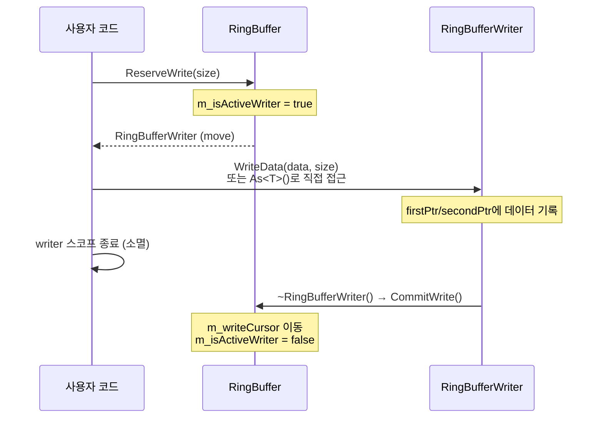
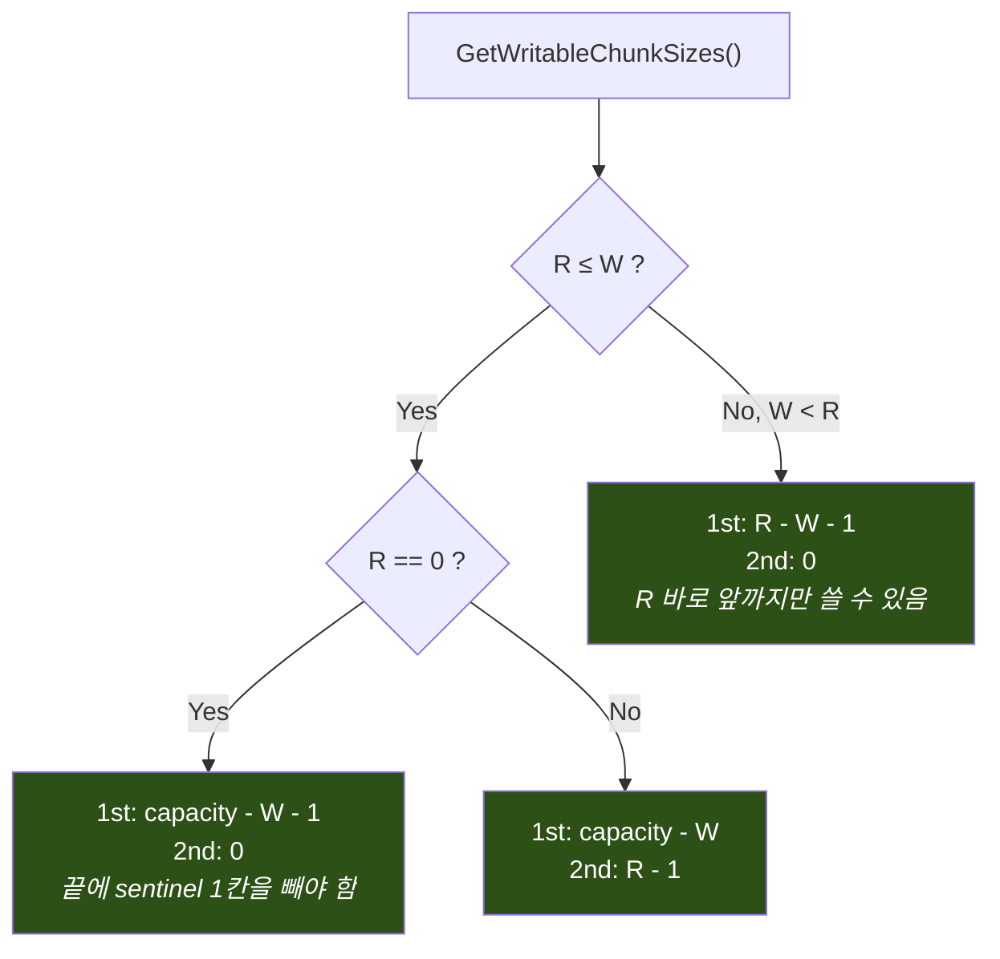
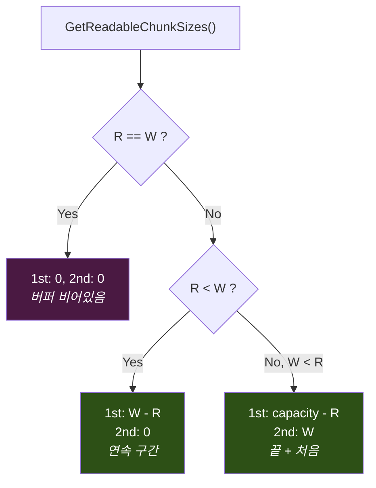

# RingBuffer

## 1. 개요

네트워크 송수신 데이터를 저장하는 **원형 버퍼(Circular Buffer)** 구현체.
**Zero-Copy** 읽기/쓰기를 위해 Scatter-Gather 방식의 RAII 핸들(`RingBufferWriter`, `RingBufferReader`)을 제공한다.

---

## 2. 클래스 구조

```mermaid
classDiagram
    class RingBuffer {
        -bool m_isActiveWriter
        -bool m_isActiveReader
        -UPtr~char[]~ m_buffer
        -UINT32 m_readCursor
        -UINT32 m_writeCursor
        -const UINT32 kCapacity
        +ReserveWrite(UINT32) RingBufferWriter
        +CommitWrite(RingBufferWriter&)
        +ReserveRead(UINT32) RingBufferReader
        +CommitRead(RingBufferReader&)
        +GetWritableSize() UINT32
        +GetReadableSize() UINT32
        +Read(void*, UINT32) UINT32
        +Peek(void*, UINT32) UINT32
        +IsEmpty() bool
        +IsFull() bool
        +Clear()
        -GetWritableChunkSizes() Chunk
        -GetReadableChunkSizes() Chunk
    }

    class RingBufferWriter {
        -RingBuffer* m_owner
        -void* m_firstPtr
        -UINT32 m_firstSize
        -void* m_secondPtr
        -UINT32 m_secondSize
        -UINT32 m_totalSize
        +IsValid() bool
        +IsWrapped() bool
        +As~T~() T*
        +WriteData(const void*, UINT32) UINT32
        +~RingBufferWriter() ※ RAII CommitWrite
    }

    class RingBufferReader {
        -RingBuffer* m_owner
        -const void* m_firstPtr
        -UINT32 m_firstSize
        -const void* m_secondPtr
        -UINT32 m_secondSize
        -UINT32 m_totalSize
        +IsValid() bool
        +IsWrapped() bool
        +As~T~() const T*
        +GetFirstPtr() const void*
        +GetSecondPtr() const void*
        +~RingBufferReader() ※ RAII CommitRead
    }

    RingBuffer --> RingBufferWriter : creates (friend)
    RingBuffer --> RingBufferReader : creates (friend)
    RingBufferWriter --> RingBuffer : m_owner (CommitWrite on ~dtor)
    RingBufferReader --> RingBuffer : m_owner (CommitRead on ~dtor)
```



**핵심 관계:**
- `RingBuffer`만이 Writer/Reader를 생성할 수 있다 (생성자가 `private`, `friend` 관계).
- Writer/Reader는 소멸 시 자동으로 `CommitWrite`/`CommitRead`를 호출한다 (RAII).
- 복사 금지, 이동만 허용 (소유권 이전).

---

## 3. 메모리 레이아웃

### 3.1 기본 구조

`RingBuffer(bufferSize)` 호출 시 `bufferSize + 1` 크기의 배열을 할당한다.
1칸은 **빈/꽉 찬 상태를 구분**하기 위한 sentinel 슬롯이다.

```
 kCapacity = bufferSize + 1
 ┌───────────────────────────────────────────────────────┐
 │ 0 │ 1 │ 2 │ 3 │ ··· │ bufferSize-1 │ bufferSize(▓) │
 └───────────────────────────────────────────────────────┘
   ▲                                        ▲
   실제 사용 가능 = bufferSize칸            sentinel 슬롯
```

- **Empty 조건**: `m_writeCursor == m_readCursor`
- **Full 조건**: `(m_writeCursor + 1) % kCapacity == m_readCursor`

---

### 3.2 커서 상태별 버퍼 모습

#### Case A: Write가 Read보다 뒤에 있을 때 (`R ≤ W`)

```
 인덱스:  0   1   2   3   4   5   6   7   8   9
        ┌───┬───┬───┬───┬───┬───┬───┬───┬───┬───┐
        │   │   │ D │ D │ D │ D │   │   │   │   │
        └───┴───┴───┴───┴───┴───┴───┴───┴───┴───┘
              ▲ R                 ▲ W
              │                   │
              읽기 시작점         쓰기 시작점

     읽기 가능 (D) : [R .. W-1]  → 연속 1개 청크
     쓰기 가능     : [W .. end] + [0 .. R-1]  → 최대 2개 청크
```

#### Case B: Write가 Read보다 앞에 있을 때 (Wrap-around, `W < R`)

```
 인덱스:  0   1   2   3   4   5   6   7   8   9
        ┌───┬───┬───┬───┬───┬───┬───┬───┬───┬───┐
        │ D │ D │   │   │   │   │ D │ D │ D │ D │
        └───┴───┴───┴───┴───┴───┴───┴───┴───┴───┘
                  ▲ W                 ▲ R
                  │                   │
                  쓰기 시작점         읽기 시작점

     읽기 가능 (D) : [R .. end] + [0 .. W-1]  → 최대 2개 청크
     쓰기 가능     : [W .. R-1]  → 연속 1개 청크
```

---

## 4. Scatter-Gather (2-Chunk) 방식

데이터가 버퍼 끝에서 처음으로 되돌아가는(Wrap) 경우, **연속된 메모리 복사 없이** 2개의 포인터로 분산 접근한다.

### 4.1 쓰기 예시: Wrap이 발생하는 경우

```
 ────────── ReserveWrite(7) 호출 ──────────

 버퍼 상태 (capacity=10):
 인덱스:  0   1   2   3   4   5   6   7   8   9
        ┌───┬───┬───┬───┬───┬───┬───┬───┬───┬───┐
        │   │   │   │   │   │   │   │ X │ X │ X │
        └───┴───┴───┴───┴───┴───┴───┴───┴───┴───┘
          ▲ R                           ▲ W

 쓰기 가능 청크:
   1st chunk: [W=7 .. 9]  → 3칸
   2nd chunk: [0 .. R-1]  → 0칸... 부족!

 → 만약 R=5 였다면:
 인덱스:  0   1   2   3   4   5   6   7   8   9
        ┌───┬───┬───┬───┬───┬───┬───┬───┬───┬───┐
        │   │   │   │   │   │ X │ X │   │   │   │
        └───┴───┴───┴───┴───┴───┴───┴───┴───┴───┘
                              ▲ R       ▲ W

   1st chunk: [W=7 .. 9]  → firstPtr = &buf[7], firstSize = 3
   2nd chunk: [0 .. 4]    → secondPtr = &buf[0], secondSize = 4

 Writer가 받는 것:
 ┌─────────────────┐     ┌──────────────────────┐
 │ firstPtr  ──────┼──→  │ buf[7] buf[8] buf[9] │  (3 bytes)
 │ firstSize = 3   │     └──────────────────────┘
 │ secondPtr ──────┼──→  ┌────────────────────────────┐
 │ secondSize = 4  │     │ buf[0] buf[1] buf[2] buf[3]│  (4 bytes)
 │ totalSize = 7   │     └────────────────────────────┘
 └─────────────────┘
```

### 4.2 읽기도 동일 원리

```
 ────────── ReserveRead(5) 호출 ──────────

 인덱스:  0   1   2   3   4   5   6   7   8   9
        ┌───┬───┬───┬───┬───┬───┬───┬───┬───┬───┐
        │ D │ D │   │   │   │   │   │   │ D │ D │
        └───┴───┴───┴───┴───┴───┴───┴───┴───┴───┘
                  ▲ W                       ▲ R

 Reader가 받는 것:
 ┌─────────────────┐     ┌──────────────┐
 │ firstPtr  ──────┼──→  │ buf[8] buf[9]│  (2 bytes, const)
 │ firstSize = 2   │     └──────────────┘
 │ secondPtr ──────┼──→  ┌──────────────┐
 │ secondSize = 2  │     │ buf[0] buf[1]│  (2 bytes, const)
 │ totalSize = 4   │     └──────────────┘
 └─────────────────┘
 ※ 요청 5 > 가용 4이므로 min(5,4)=4로 클램핑됨
```

---

## 5. RAII 라이프사이클

Writer/Reader는 **한 번에 하나씩만** 활성화 가능하며, 소멸자에서 자동 커밋된다.




---

## 6. 핵심 알고리즘 - Chunk 크기 계산

### GetWritableChunkSizes()



### GetReadableChunkSizes()



---

## 7. 사용법

### 7.1 Zero-Copy 쓰기 (WriteData)

```cpp
RingBuffer rb(1024);

// 스코프 기반 자동 커밋
{
    RingBufferWriter writer = rb.ReserveWrite(sizeof(PacketHeader) + payloadSize);
    if (writer.IsValid())
    {
        writer.WriteData(&header, sizeof(PacketHeader));
        // ※ WriteData는 firstPtr → secondPtr 순서로 scatter write 수행
    }
}   // ← 여기서 ~RingBufferWriter() → CommitWrite() 자동 호출
```

### 7.2 Zero-Copy 쓰기 (As\<T\> - 구조체 직접 접근)

```cpp
{
    RingBufferWriter writer = rb.ReserveWrite(sizeof(MyStruct));
    if (writer.IsValid() && !writer.IsWrapped())
    {
        MyStruct* ptr = writer.As<MyStruct>();
        ptr->field1 = 42;
        ptr->field2 = 3.14f;
        // Wrap 되지 않은 경우에만 사용 가능 (연속 메모리 보장)
    }
}   // 자동 커밋
```

### 7.3 Zero-Copy 읽기

```cpp
{
    RingBufferReader reader = rb.ReserveRead(sizeof(PacketHeader));
    if (reader.IsValid())
    {
        if (!reader.IsWrapped())
        {
            // 연속 메모리: 캐스팅으로 바로 접근
            const PacketHeader* hdr = reader.As<PacketHeader>();
            ProcessPacket(hdr);
        }
        else
        {
            // Wrap된 경우: 2개 청크를 개별 처리
            const void* p1 = reader.GetFirstPtr();   // size = reader.GetFirstSize()
            const void* p2 = reader.GetSecondPtr();   // size = reader.GetSecondSize()
            // 필요시 별도 버퍼에 합쳐서 처리
        }
    }
}   // 자동 커밋 → readCursor 이동
```

### 7.4 단순 복사 방식 (Read / Peek)

```cpp
// Peek: 데이터를 읽되 커서를 이동하지 않음
char peekBuf[128];
UINT32 peeked = rb.Peek(peekBuf, 128);

// Read: 데이터를 읽고 커서도 이동
char readBuf[128];
UINT32 read = rb.Read(readBuf, 128);
```

---

## 8. 안전장치 정리

```
 ┌──────────────────────────────────────────────────────────────┐
 │                    ASSERT 검증 목록                           │
 ├──────────────────────────────────────────────────────────────┤
 │                                                              │
 │  ■ 동시 활성 방지                                             │
 │    ├─ Writer 이미 활성 상태에서 ReserveWrite → ASSERT 실패     │
 │    └─ Reader 이미 활성 상태에서 ReserveRead → ASSERT 실패      │
 │                                                              │
 │  ■ 소멸자 검증                                                │
 │    ├─ ~RingBuffer() 시 Writer/Reader 활성 → ASSERT 실패       │
 │    └─ ~RingBuffer() 시 버퍼 비어있지 않음 → ASSERT 실패        │
 │                                                              │
 │  ■ 데이터 무결성                                              │
 │    ├─ firstSize + secondSize != totalSize → ASSERT 실패       │
 │    └─ Wrap된 Reader에 As<T>() 호출 → ASSERT 실패              │
 │                                                              │
 │  ■ 크기 검증                                                  │
 │    ├─ bufferSize == 0 으로 생성 → ASSERT 실패                  │
 │    ├─ ReserveWrite(0) → ASSERT 실패                           │
 │    └─ ReserveRead(0) → ASSERT 실패                            │
 │                                                              │
 └──────────────────────────────────────────────────────────────┘
```

---

## 9. 파일 구성

```
Include/DataStruct/RingBuffer/
├── RingBuffer.h           ← 메인 클래스 (Writer/Reader 생성, 커서 관리)
├── RingBufferWriter.h     ← 쓰기 RAII 핸들 (Scatter-Gather 쓰기)
└── RingBufferReader.h     ← 읽기 RAII 핸들 (Zero-Copy 읽기)

Source/DataStruct/RingBuffer/
├── RingBuffer.cpp         ← Reserve/Commit, Chunk 계산, Read/Peek
├── RingBufferWriter.cpp   ← 이동 시맨틱스, WriteData, RAII 소멸자
└── RingBufferReader.cpp   ← 이동 시맨틱스, RAII 소멸자
```
