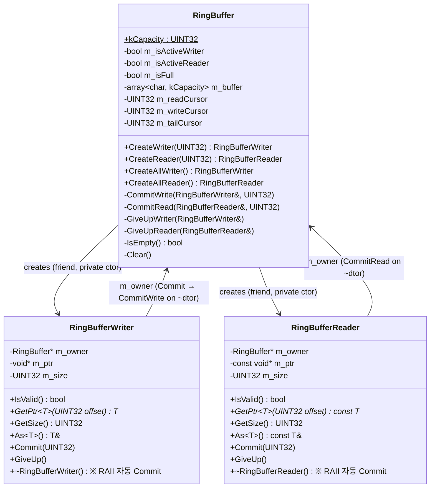
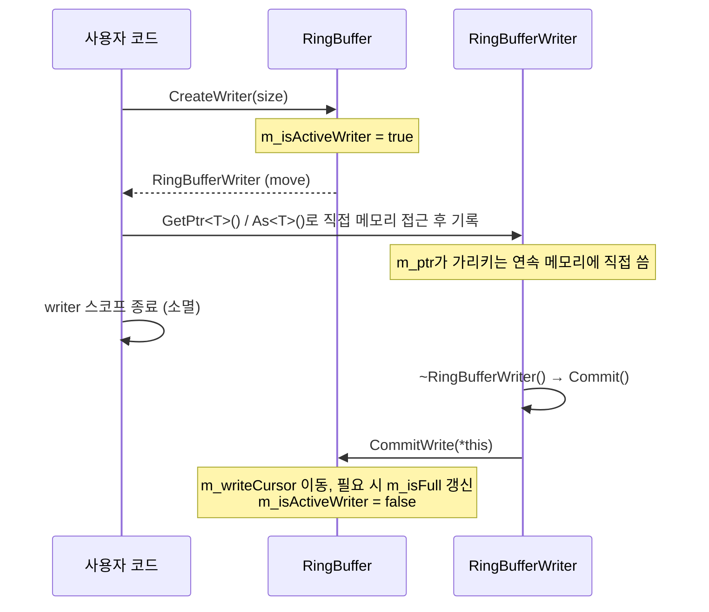
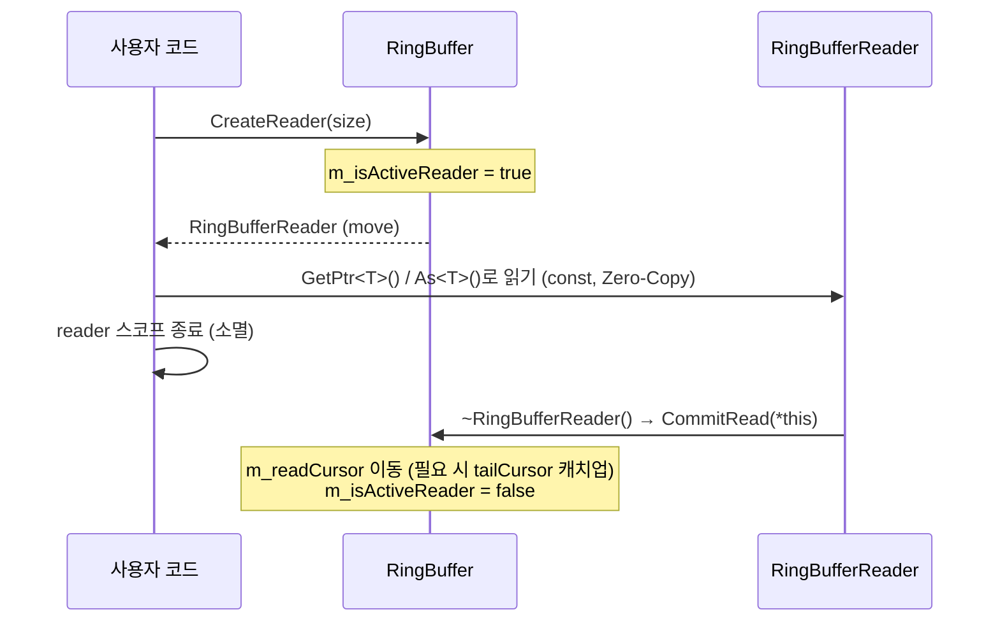

# RingBuffer

## 1. 개요

네트워크 송수신 데이터를 저장하는 **고정 크기(컴파일 타임 `kCapacity`) 원형 버퍼(Circular Buffer)** 구현체.
**Zero-Copy** 접근을 위한 RAII 핸들(`RingBufferWriter`, `RingBufferReader`)을 제공한다.

각 예약(reserve)은 항상 버퍼 안의 **연속된 단일 구간**으로만 반환된다. 즉, 하나의 예약이 버퍼 끝과 처음에 걸쳐 두 조각으로 쪼개지는 경우는 없다 (Scatter-Gather 방식이 아니다). 꼬리 공간이 부족하면 그 경계를 `m_tailCursor`에 기록해두고 앞쪽(index 0)으로 건너뛰어 쓰기를 이어가는 **tail-skip 방식**을 사용한다.

---

## 2. 클래스 구조



**핵심 관계:**
- `RingBuffer`만이 Writer/Reader를 생성할 수 있다 (생성자가 `private`, `friend` 관계).
- 예약은 항상 버퍼 안의 연속된 단일 구간이다. 요청 크기가 그 시점에 연속으로 확보 가능한 공간을 넘으면, **Writer는 예약 자체가 실패**(invalid 핸들 반환)하고, **Reader는 확보 가능한 크기로 clamp**한다.
- Writer/Reader는 소멸 시 자동으로 `Commit()`을 호출한다 (RAII). 커밋 없이 취소하려면 `GiveUp()`을 명시적으로 호출한다.
- 복사 금지, 이동만 허용 (소유권 이전). 단 서로 다른 `RingBuffer` 인스턴스 간의 이동은 금지된다.

---

## 3. 메모리 레이아웃

### 3.1 기본 구조

`kCapacity`는 `static constexpr UINT32 kCapacity = 1024 * 16`으로 **컴파일 타임에 고정**되며, 생성자에 크기를 넘겨 런타임에 바꿀 수 없다. 별도의 sentinel 슬롯도 없다 — 빈/꽉 찬 상태는 `m_isFull` 불리언 플래그로 구분한다.

```
 kCapacity = 1024 * 16 (고정)
 ┌───────────────────────────────────────────────────────┐
 │ 0 │ 1 │ 2 │ 3 │ ··· │ kCapacity-1 │
 └───────────────────────────────────────────────────────┘
```

- **Empty 조건**: `!m_isFull && (m_writeCursor == m_readCursor)`
- **Full 조건**: `m_isFull == true` (마지막 `CommitWrite`로 인해 `m_writeCursor == m_readCursor`가 되면 설정됨)

---

### 3.2 tail-skip 동작 (wrap 처리)

`m_tailCursor`는 "이 지점까지가 유효한 데이터 끝"이라는 경계를 기록하는 커서다. 평상시엔 `kCapacity`와 같아서 아무 의미가 없다가, 꼬리 공간이 부족해 앞으로 건너뛸 때만 옛 `m_writeCursor` 값을 저장한다.

```
 (1) 순차적으로 채워진 초기 상태 (capacity=10 가정)
 인덱스:  0   1   2   3   4   5   6   7   8   9
        ┌───┬───┬───┬───┬───┬───┬───┬───┬───┬───┐
        │   │   │ D │ D │ D │ D │   │   │   │   │
        └───┴───┴───┴───┴───┴───┴───┴───┴───┴───┘
              ▲ R                 ▲ W
        m_tailCursor = kCapacity(=10)  ※ 아직 wrap 안 함

 (2) CreateWriter(5) 호출: 꼬리 [W..9] = 4칸 → 부족.
     앞쪽 [0..R-1] = 2칸도 부족 → 예약 실패 (invalid Writer 반환, 부분 예약 없음)

 (3) 꼬리는 부족하지만 앞쪽엔 공간이 있는 경우 (writeSize <= R):
     m_tailCursor = m_writeCursor (옛 W 값 기억)
     m_writeCursor = 0
     → 이후 CreateWriter는 인덱스 0부터 다시 시작

 인덱스:  0   1   2   3   4   5   6   7   8   9
        ┌───┬───┬───┬───┬───┬───┬───┬───┬───┬───┐
        │ D │   │ D │ D │ D │ D │   │   │   │▓▓▓│  ▓ = tailCursor 뒤 미사용 구간
        └───┴───┴───┴───┴───┴───┴───┴───┴───┴───┘
          ▲ W(new)   ▲ R                     ▲ m_tailCursor(=옛 W)

 (4) Reader가 m_tailCursor까지 다 읽으면 (m_readCursor == m_tailCursor):
     m_readCursor = 0, m_tailCursor = kCapacity 로 리셋 → 다시 (1) 상태처럼 순환
```

---

## 4. 예약 실패/clamp 규칙

기존 "Scatter-Gather" 방식과 달리, 한 번의 예약은 절대 두 조각으로 나뉘지 않는다. 대신 Writer와 Reader의 동작이 서로 다르다.

### 4.1 CreateWriter(writeSize) — 전부 아니면 실패

```
 요청한 크기를 연속으로 확보할 수 없으면 예약 자체가 실패한다 (invalid Writer 반환).
 호출자는 나중에 다시 시도해야 한다 (backpressure).

 판단 순서:
  1) m_isFull 이면 즉시 실패
  2) R <= W (아직 wrap 안 한 상태)
     a) 꼬리 공간 (kCapacity - W) >= writeSize → 꼬리에서 그대로 사용
     b) 아니면 앞쪽 공간 (R) >= writeSize → tailCursor=W, W=0 으로 점프해서 사용
     c) 둘 다 부족 → 실패
  3) W < R (이미 한 번 wrap한 상태)
     a) 남은 공간 (R - W) >= writeSize → 그대로 사용
     b) 부족 → 실패
```

### 4.2 CreateReader(readSize) — 가능한 만큼 clamp

```
 요청한 크기보다 연속으로 읽을 수 있는 데이터가 적으면, 그 크기만큼 clamp해서 돌려준다.

 판단 순서:
  1) m_readCursor == m_tailCursor 이면 wrap 캐치업 (R=0, tailCursor=kCapacity)
  2) 버퍼가 비어있으면 실패 (invalid Reader 반환)
  3) 연속 읽기 가능 크기 = (R < W) ? (W - R) : (tailCursor - R)
  4) readSize = min(요청 크기, 연속 읽기 가능 크기)
  5) readSize == 0 이면 실패
```

### 4.3 CreateAllWriter / CreateAllReader

정확한 크기를 모를 때(예: 소켓 recv/send처럼 "지금 연속으로 쓰거나 읽을 수 있는 만큼 전부"가 필요한 경우) 사용한다. 요청 크기 파라미터가 없고, 그 시점에 연속으로 확보 가능한 만큼을 그대로 예약한다. 확보 가능한 공간이 0이면 실패(invalid 반환)한다.

---

## 5. RAII 라이프사이클

Writer/Reader는 **한 번에 하나씩만** 활성화 가능하며, 소멸자에서 자동 커밋된다.





---

## 6. 사용법

### 6.1 Zero-Copy 쓰기

```cpp
RingBuffer rb;  // 크기는 컴파일 타임 kCapacity로 고정, 생성자에 크기 인자 없음

{
    RingBufferWriter writer = rb.CreateWriter(PacketHeader::kHeaderSize + payloadSize);
    if (writer.IsValid())
    {
        PacketHeader& header = writer.As<PacketHeader>();
        header.m_size = static_cast<UINT16>(PacketHeader::kHeaderSize + payloadSize);
        header.m_id = packetId;

        std::memcpy(writer.GetPtr(PacketHeader::kHeaderSize), payload, payloadSize);
    }
    // writer가 invalid면 지금은 연속 공간이 부족한 것 — 나중에 재시도
}   // ← 여기서 ~RingBufferWriter() → Commit() → CommitWrite() 자동 호출
```

### 6.2 CreateAllWriter / CreateAllReader (소켓 I/O 등, 크기를 미리 모를 때)

```cpp
RingBufferWriter writer = rb.CreateAllWriter();
if (writer.IsValid())
{
    std::size_t received = socket.receive(boost::asio::buffer(writer.GetPtr(), writer.GetSize()));
    writer.Commit(static_cast<UINT32>(received));  // 실제로 받은 만큼만 커밋
}
```

### 6.3 Zero-Copy 읽기

```cpp
{
    RingBufferReader reader = rb.CreateReader(PacketHeader::kHeaderSize);
    if (reader.IsValid() && reader.GetSize() == PacketHeader::kHeaderSize)
    {
        const PacketHeader& header = reader.As<PacketHeader>();
        ProcessPacket(header);
    }
    else if (reader.IsValid())
    {
        // 요청한 크기보다 적게 확보된 경우(clamp) — 커밋하지 않고 되돌린다
        reader.GiveUp();
    }
}   // 커밋 시 자동으로 readCursor 이동
```

### 6.4 예약 취소 (GiveUp)

```cpp
RingBufferReader reader = rb.CreateReader(PacketHeader::kHeaderSize);
if (reader.IsValid() && reader.GetSize() < PacketHeader::kHeaderSize)
{
    reader.GiveUp();  // 커서를 옮기지 않고 예약만 취소 (다음 recv 이후 재시도)
}
```

> 참고: 이 클래스는 `memcpy` 기반의 `Read()`/`Peek()` 헬퍼를 제공하지 않는다. 모든 접근은 `GetPtr<T>()`/`As<T>()`를 통한 Zero-Copy 포인터 접근뿐이다.

---

## 7. 안전장치 정리

```
 ┌──────────────────────────────────────────────────────────────┐
 │                    ASSERT 검증 목록                           │
 ├──────────────────────────────────────────────────────────────┤
 │                                                              │
 │  ■ 동시 활성 방지                                             │
 │    ├─ Writer 이미 활성 상태에서 CreateWriter → ASSERT 실패     │
 │    └─ Reader 이미 활성 상태에서 CreateReader → ASSERT 실패     │
 │                                                              │
 │  ■ 소멸자 검증                                                │
 │    ├─ ~RingBuffer() 시 Writer/Reader 활성 → ASSERT 실패       │
 │    └─ ~RingBuffer() 시 버퍼 비어있지 않음 → ASSERT 실패        │
 │                                                              │
 │  ■ 커밋 무결성                                                │
 │    ├─ CommitWrite: writeSize > 예약 크기 → ASSERT 실패         │
 │    ├─ CommitWrite: m_writeCursor + writeSize > kCapacity      │
 │    │   → ASSERT 실패 ("Write cursor overflow")                │
 │    ├─ CommitRead: readSize > 예약 크기 → ASSERT 실패           │
 │    └─ CommitRead: m_readCursor > m_tailCursor                 │
 │        → ASSERT 실패 ("Read cursor overflow")                 │
 │                                                              │
 │  ■ 핸들 무결성                                                │
 │    ├─ 서로 다른 RingBuffer 간 Writer/Reader move 대입          │
 │    │   → ASSERT 실패 ("Cannot move ... from different buffer")│
 │    ├─ GetPtr<T>(offset)에서 offset > 예약 크기                │
 │    │   → ASSERT 실패 ("Offset out of bounds")                 │
 │    └─ invalid 상태에서 Commit/GiveUp/As 호출 → ASSERT 실패     │
 │                                                              │
 │  ■ 크기 검증                                                  │
 │    ├─ CreateWriter(0) → ASSERT 실패 ("Write size is 0")        │
 │    └─ CreateReader(0) → ASSERT 실패 ("Read size is 0")         │
 │                                                              │
 └──────────────────────────────────────────────────────────────┘
```

---

## 8. 파일 구성

```
Include/DataStruct/RingBuffer/
├── RingBuffer.h           ← 메인 클래스 (Writer/Reader 생성, 커서/tailCursor 관리)
├── RingBufferWriter.h     ← 쓰기 RAII 핸들 (단일 연속 구간, GetPtr/As로 접근)
└── RingBufferReader.h     ← 읽기 RAII 핸들 (단일 연속 구간, GetPtr/As로 접근, const)

Source/DataStruct/RingBuffer/
├── RingBuffer.cpp         ← Create/Commit/GiveUp, 커서 이동, tail-skip 처리
├── RingBufferWriter.cpp   ← 이동 시맨틱스, RAII 소멸자(자동 Commit)
└── RingBufferReader.cpp   ← 이동 시맨틱스, RAII 소멸자(자동 Commit)
```