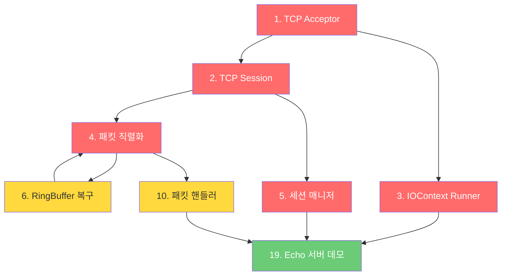

# 🐧 TuxBase-MMO 추천 작업 리스트

현재 프로젝트 상태를 분석한 결과, 아래와 같은 작업들을 추천합니다.

> [!NOTE]
> 기존 TodoList의 항목(pch 활용, ReadMe 작성, Doc 정리, 테스트 추가)은 제외하고, **추가로 할 수 있는 작업**만 정리했습니다.

---

## 🔴 우선순위 높음 — 서버 엔진 핵심 기능

| # | 작업 | 설명 | 품질 레벨 | 예상 난이도 |
|---|------|------|-----------|------------|
| 1 | **TCP Acceptor / Listener 구현** | `INetworkAcceptor` 인터페이스 + `BoostNetworkAcceptor` 구현. 클라이언트 접속을 받아들이는 첫 관문 | L3 | ⭐⭐⭐ |
| 2 | **TCP Session 클래스 구현** | `boost::asio` 기반 비동기 읽기/쓰기 세션. `shared_from_this` 패턴 활용 | L3 | ⭐⭐⭐ |
| 3 | **IOContext Runner (서버 루프)** | `io_context::run()`을 멀티스레드로 구동하는 서버 메인 루프 구현 | L2 | ⭐⭐ |
| 4 | **패킷 직렬화/역직렬화** | 패킷 헤더(ID+길이) + 바디 구조 정의, `RingBuffer` 연동 | L3 | ⭐⭐⭐ |
| 5 | **세션 매니저** | 접속된 세션들을 관리(추가/제거/조회)하는 `ISessionManager` + 구현체 | L3 | ⭐⭐ |

---

## 🟡 우선순위 중간 — 인프라 및 아키텍처

| # | 작업 | 설명 | 품질 레벨 | 예상 난이도 |
|---|------|------|-----------|------------|
| 6 | **RingBuffer 복구 및 완성** | 현재 빌드 제외 상태인 `RingBuffer`를 수정하여 정상 빌드되게 하고, 패킷 버퍼로 활용 | L2 | ⭐⭐ |
| 7 | **Config/설정 시스템** | JSON 또는 TOML 기반 서버 설정 파일 로드 (포트, 스레드 수, DB 접속 정보 등) | L2 | ⭐⭐ |
| 8 | **네임스페이스 통일** | `common::` → `TuxBase::` 로 네임스페이스 통일 (가이드라인 준수) | L1 | ⭐ |
| 9 | **SignalHandler (Graceful Shutdown)** | `SIGINT`/`SIGTERM` 시그널 핸들링으로 서버를 안전하게 종료하는 로직 | L2 | ⭐⭐ |
| 10 | **패킷 핸들러 디스패처** | 패킷 ID → 핸들러 함수 매핑 시스템. Command 패턴 적용 가능 | L3~L4 | ⭐⭐⭐ |

---

## 🟢 우선순위 낮음 — 품질/운영 개선

| # | 작업 | 설명 | 품질 레벨 | 예상 난이도 |
|---|------|------|-----------|------------|
| 11 | **CI/CD 파이프라인** | GitHub Actions로 push 시 Docker 빌드 + 테스트 자동화 | L1 | ⭐⭐ |
| 12 | **clang-tidy / clang-format 자동화** | `.clang-tidy`, `.clang-format` 설정 + CMake 연동으로 빌드 시 자동 검사 | L1 | ⭐ |
| 13 | **Logger → 파일 출력 Sink 추가** | 현재 Logger에 파일 출력 `ISink` 구현체 추가 (로테이션 포함) | L2 | ⭐⭐ |
| 14 | **Redis 연동 준비** | `docker-compose`에 Redis 컨테이너 추가 + C++ Redis 클라이언트 라이브러리 vcpkg 등록 | L2 | ⭐⭐ |
| 15 | **MSSQL 연동 준비** | `docker-compose`에 MSSQL 컨테이너 추가 + ODBC 드라이버 설정 | L2 | ⭐⭐ |

---

## 🔵 확장/심화 — 게임 서버 기능

| # | 작업 | 설명 | 품질 레벨 | 예상 난이도 |
|---|------|------|-----------|------------|
| 16 | **스레드 풀 구현** | `boost::asio::thread_pool` 래핑 또는 자체 스레드 풀로 작업 분산 처리 | L3 | ⭐⭐⭐ |
| 17 | **타이머/스케줄러** | 주기적 작업(하트비트, 월드 틱 등) 실행을 위한 타이머 시스템 | L2~L3 | ⭐⭐ |
| 18 | **오브젝트 풀 (메모리 풀)** | 세션/패킷 등 빈번하게 생성·소멸되는 객체를 재사용하는 풀 | L2 | ⭐⭐⭐ |
| 19 | **Echo 서버 데모** | 위 네트워크 기능을 조합하여 Echo(에코) 서버 구동 데모 구현 | L2 | ⭐⭐ |
| 20 | **03_Share 공유 프로젝트** | 서버-클라이언트 공유 프로토콜, 패킷 정의, DTO 등을 담는 공유 라이브러리 생성 | L2 | ⭐⭐ |

---

## 📌 추천 작업 순서

> **가장 추천하는 첫 작업**: `#1 TCP Acceptor` → `#2 TCP Session` → `#3 IOContext Runner` 순으로 진행하면, 가장 빠르게 **"접속이 되는 서버"**를 만들어볼 수 있습니다!
